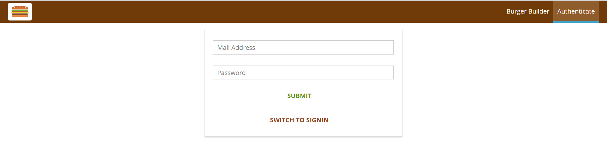
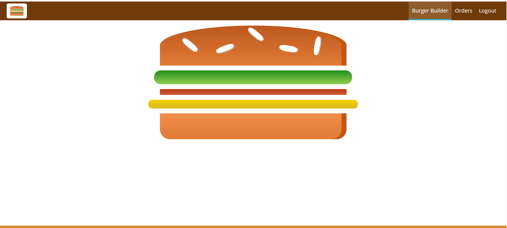
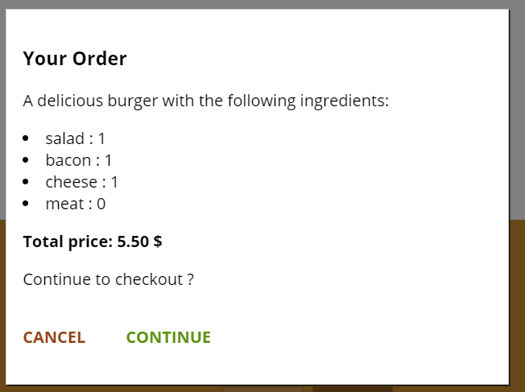
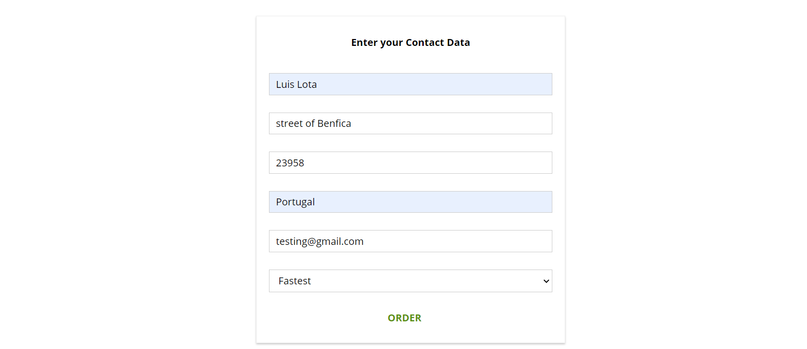
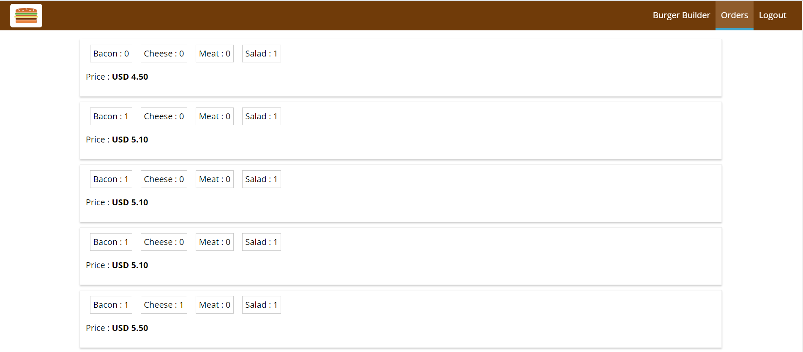

# Burger-Builder


App created to learn React.js  using Udemy course by Maximilian Schwarzmüller https://www.udemy.com/course/react-the-complete-guide-incl-redux/


In this Project is using 
1. Routing 
2. Create components 
3. Redux
4. Authentication with firebase  
5. Axios

# How to start 
Then open in [http://localhost:3000/](http://localhost:3000/) 
> deployed in https://react-my-burger-3281f.web.app/


```sh
npm install 

npm start

```

# Core features of Burger-Builder

## Can create or signup for an user 


## Create awesome burger 



## Create actions with ingredients


## Summary of your burger 



## You can order what you ask !



## See what orders you already have 

